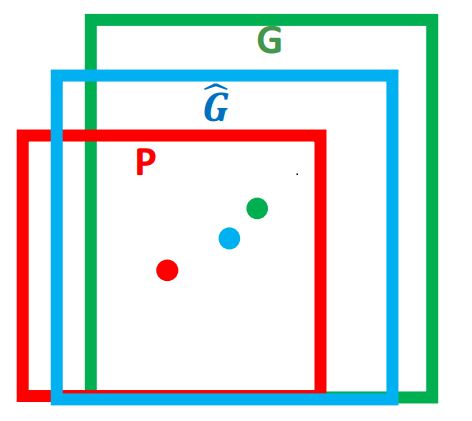
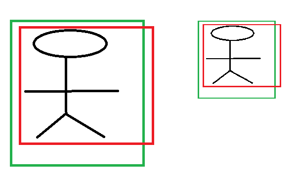

# Faster-RCNN原理

## 🖌 1、R-CNN

 **论文：Rich feature hierarchies for accurate object detection and semantic segmentation**

R**-**CNN算法分为4个步骤

* 一张图像生成`1K~2K`个**候选区域（`ROI`）；**
* 对每个候选区域（Warp后的Region）使用深度网络**提取特征；**
* 将特征送入每一类的**`SVM` 分类器**，判别是否属于该类；
* 使用**回归器**精细修正候选框位置。

### 🖋 1.1、候选区域生成

使用了Selective Search方法从一张图像生成约2000-3000个候选区域（Region Proposal）。基本思路如下：

* 使用一种过分割手段，将图像分割成小区域；
* 查看现有小区域，合并可能性最高的两个区域，重复直到整张图像合并成一个区域位置；
* 输出所有曾经存在过的区域，所谓候选区域。

候选区域生成和后续步骤相对独立，实际可以使用任意算法进行。

#### ✏ 1.1.1、合并规则

优先合并以下四种区域：

* 颜色（颜色直方图）相近的 
* 纹理（梯度直方图）相近的 
* 合并后总面积小的 
* 合并后，总面积在其`bbox`中所占比例大的

第三条，保证合并操作的尺度较为均匀，避免一个大区域陆续“吃掉”其他小区域。 例：设有区域：a-b-c-d-e-f-g-h。 较好的合并方式是：`ab-cd-ef-gh -> abcd-efgh -> abcdefgh`。 不好的合并方法是：`ab-c-d-e-f-g-h ->abcd-e-f-g-h ->abcdef-gh -> abcdefgh`。

第四条，保证合并后形状规则。 例：左图适于合并，右图不适于合并：

上述四条规则只涉及区域的颜色直方图、纹理直方图、面积和位置。合并后的区域特征可以直接由子区域特征计算而来，速度较快。

#### ✏ 1.1.2、缩放候选区域

因为CNN对输入图像的大小有限制，所以在将候选区域输入CNN网络之前，要将候选区域进行固定尺寸的缩放。缩放分为两大类：

1）各向同性缩放，长宽放缩相同的倍数

* tightest square with context：把region proposal的边界进行扩展延伸成正方形，灰色部分用原始图片中的相应像素填补，如图\(B\)所示
* tightest square without context：把region proposal的边界进行扩展延伸成正方形，灰色部分不填补，如图\(C\)所示

2）各向异性缩放, 长宽放缩的倍数不同 不管图片是否扭曲，长宽缩放的比例可能不一样，直接将长宽缩放到`227x227`，如图\(D\)所示。在放缩之前，作者考虑，在region proposal周围补额外的原始图片像素（pad p）。上图中，第一层p=0，第二层p=16。最后试验发现，采用各向异性缩放并且p=16的时候效果最好。

#### ✏ 1.1.3、多样化与后处理

为尽可能不遗漏候选区域，上述操作在多个颜色空间中同时进行（`RGB,HSV,Lab`等）。在一个颜色空间中，使用上述四条规则的不同组合进行合并。**所有颜色空间与所有规则的全部结果，在去除重复后，都作为候选区域输出。**

### 🖋 **1.2、**特征提取

#### ✏ 1.2.1、预处理：监督预训练 

使用深度网络提取特征之前，首先把候选区域（Warp后的Region）归一化成同一尺寸`227×227`。

**网络结构**

基本借鉴Hinton 2012年在`ImageNet`上的分类网络，略作简化。

此网络提取的特征为4096维，之后送入一个`4096->1000`的全连接层进行分类。 学习率0.01。

**训练数据**

使用`ILVCR 2012`的全部数据进行训练，输入一张图片，输出1000维的类别标号。

### 🖋 1.3、类别判断

将缩放后的图片输入CNN进行特征提取，对CNN输出的特征用`SVM`进行打分\(每类都有一个`SVM`，21类就有21个`SVM`分类器\)，**对打好分的区域使用`NMS`即非极大抑制（每类都单独使用）。**

**分类器** 

首先要说明的是，每个候选区域经过CNN后得到的4096维特征，一种方法是经过`FC`后送入`softmax`直接分类，一种是采用如`SVM`的分类器进行分类。但是在这里，对每一类目标，使用一个线性`SVM`二类分类器进行判别。输入为深度网络输出的 4096 维特征，输出是否属于此类。 由于负样本很多，使用hard negative mining方法。

#### hard negative mining方法 ：

* **正样本：**本类的真值标定框。 
* **负样本：**考察每一个候选框，如果和本类所有标定框的重叠都小于 0.3，认定其为负样本。

> **1）为什么fine-tuning与`SVM`正负样本定义不一样？**  
> 在训练`SVM`时，正样本为ground truth，负样本定义为与ground truth的`IoU`小于 0.3 的候选区域为负样本，落入灰色区域（超过 0.3 `IoU`重叠，但不是真实值）的候选区域被忽略。fine-tuning时担心过拟合的原因，要扩大正样本的样本量，所以定义比较宽松，但是`SVM`是最终用于分类的分类器，而且`SVM`原理就是最小的距离最大化，越难分的数据越有利于`SVM`的训练，所以对样本的定义比较严格。
>
> **2）为什么不直接用`softmax`的输出结果？**  
> 因为在训练`softmax`的时候数据本来就不是很准确，而`SVM`的训练使用的是hard negative也就是样本比较严格，所以`SVM`效果会更好。

### 🖋 1.4、位置精修（回归器）

目标检测问题的衡量标准是重叠面积：许多看似准确的检测结果，往往因为候选框不够准确，重叠面积很小。故需要一个位置精修步骤。

**回归器** ：对每一类目标，使用一个线性回归器进行精修。正则项 $$\lambda=10000$$ 。 输入为深度网络`pool5`层的 4096 维特征，输出为 $$x,y$$ 方向的缩放和平移。

**训练样本** ：判定为本类的候选框中，和真值重叠面积大于 `0.6` 的候选框。

**`BoundingBox Regression（BBR）`** ：对于预测框 P，我们有一个ground truth是 G：当 `0.1< IoU < 0.5` 时出现重复，这种情况属于作者说的`poor localiazation`， 因此使用 `IoU>0.6` 的 Bounding Box 进行`BBR`，也就是 `IoU<0.6` 的 Bounding Box 会直接被舍弃，不进行`BBR`。这样做是为了满足线性转换的条件。

#### ✏ 1.4.1、边框回归是什么？ 

对于窗口一般使用四维向量 $$(x,y,w,h)$$ 来表示， 分别表示窗口的中心点坐标和宽高。 对于图 2, 红色的框 P 代表原始的Proposal, 绿色的框 G 代表目标的 Ground Truth， 我们的目标是寻找一种关系使得输入原始的窗口 P 经过映射得到一个跟真实窗口 G 更接近的回归窗口 $$\hat G$$ 。

边框回归的目的既是：给定 $$(P_x,P_y,P_w,P_h)$$ 寻找一种映射 $$f$$ ， 使得 $$f(P_x,P_y,P_w,P_h)=(\hat G_x,\hat G_y,\hat G_w,\hat G_h)$$ 并且 $$(\hat G_x,\hat G_y,\hat G_w,\hat G_h)\approx (G_x,G_y,G_w,G_h)$$ 。

#### ✏ 1.4.2、边框回归怎么做的？ 

那么经过何种变换才能从图 2 中的窗口 P 变为窗口 $$\hat G$$ 呢？ 比较简单的思路就是：平移+尺度放缩：

1、先做平移 $$(\Delta x,\Delta y)， \Delta x=P_w d_x(P),\Delta y=P_h d_y(P)$$ ，这是R-CNN论文的：

$$
\begin{align}
\hat G_x &= P_w d_x(P) + P_x \tag{1} \\
\hat G_y &= P_h d_y(P) + P_y \tag{2}
\end{align}
$$

2、然后再做尺度缩放 $$(S_w,S_h), S_w=exp(d_w(P)),S_h=exp(d_h(P))$$ ，对应论文中：

$$
\begin{align}
\hat G_w= P_w exp(d_w(P) )  \tag{3}\\
\hat G_h= P_h exp(d_h(P) ) \tag{4}
\end{align}
$$

观察\(1\)~\(4\)我们发现， 边框回归学习就是 $$d_x(P),d_y(P),d_w(P),d_h(P)$$ 这四个变换。下一步就是设计算法那得到这四个映射。

线性回归就是给定输入的特征向量 `X`，学习一组参数 `W`，使得经过线性回归后的值跟真实值 Y\(Ground Truth\)非常接近. 即 $$Y\approx WX$$ 。 那么 Bounding-box 中我们的输入以及输出分别是什么呢？

**Input**

$$\text{RegionProposal}→P=(P_x,P_y,P_w,P_h)$$ ，这个是什么？ 输入就是这四个数值吗？其实真正的输入是这个窗口对应的 CNN 特征，也就是 R-CNN 中的 `Pool5 feature`（特征向量）。 \(注：训练阶段输入还包括 Ground Truth， 也就是下边提到的 $$t_∗=(t_x,t_y,t_w,t_h)$$ 。

**Output**

需要进行的平移变换和尺度缩放 $$d_x(P),d_y(P),d_w(P),d_h(P)$$ ， 或者说是 $$\Delta x,\Delta y,S_w,S_h$$ 。 我们的最终输出不应该是 Ground Truth 吗？ 是的， 但是有了这四个变换我们就可以直接得到 Ground Truth， 这里还有个问题， 根据\(1\)~\(4\)我们可以知道， P 经过 $$d_x(P),d_y(P),d_w(P),d_h(P)$$ 得到的并不是真实值 G， 而是预测值 $$\hat G$$ 。 的确， 这四个值应该是经过 Ground Truth 和 Proposal 计算得到的真正需要的平移量 $$(t_x,t_y)$$ 和尺度缩放 $$(t_w,t_h)$$ ：

$$
\begin{align}
t_x &= (G_x - P_x) / P_w  \tag{5}\\
t_y &= (G_y - P_y) / P_h \tag{6}\\
t_w &= \log (G_w / P_w) \tag{7}\\
t_h &= \log(G_h / P_h) \tag{8}
\end{align}
$$

那么目标函数可以表示为 $$d_∗(P)=w^T_∗\Phi_5(P)$$ ， $$\Phi_5(P)$$ 是输入 Proposal 的特征向量， $$w_*$$ 是要学习的参数（`*`表示 `x,y,w,h`， 也就是每一个变换对应一个目标函数） ， $$d_∗(P)$$ 是得到的预测值。 我们要让预测值跟真实值 $$t_∗=(t_x,t_y,t_w,t_h)$$ 差距最小， 得到损失函数为：

$$
Loss = \sum_i^N(t_*^i - \hat w_*^T\phi_5(P^i))^2 \tag{9}
$$

函数优化目标为：

$$
W_* = argmin_{w_*} \sum_i^N(t_*^i - \hat w_*^T\phi_5(P^i))^2 + \lambda || \hat w_*||^2 \tag{10}
$$

利用梯度下降法或者最小二乘法就可以得到 $$w_∗$$ 。

#### ✏ 1.4.3、为什么宽高尺度会设计这种形式？ 

为什么设计的 $$t_x,t_y$$ 为什么除以宽高，为什么 $$t_w,t_h$$ 会有log形式？

首先CNN具有尺度不变性：

**x,y 坐标除以宽高** 

上图的两个人具有不同的尺度，因为他都是人，我们得到的特征相同。假设我们得到的特征为 $$\Phi_1,\Phi_2$$ ，那么一个完好的特征应该具备 $$\Phi_1 = \Phi_2$$ 。如果我们直接学习坐标差值，以 `x` 坐标为例， $$x_i,p_i$$ 分别代表第 `i` 个框的`x`坐标，学习到的映射为 $$f,f(\Phi_1)=x_1−p_1$$ ，同理 $$f(\Phi_2)=x_2−p_2$$ 。从上图显而易见， $$x_1−p_1\neq x_2−p_1$$ 。也就是说同一个 `x` 对应多个 `y`，这明显不满足函数的定义。边框回归学习的是回归函数，然而你的目标却不满足函数定义，当然学习不到什么。

**宽高坐标Log形式** 

我们想要得到一个放缩的尺度，也就是说这里限制尺度必须大于 0。我们学习的 $$t_w,t_h$$ 怎么保证满足大于 0 呢？直观的想法就是EXP函数，如公式\(3\)，\(4\)所示，那么反过来推导就是Log函数的来源了。

#### ✏ 1.4.4、为什么`IoU`较大，认为是线性变换？ 

当输入的 Proposal 与 Ground Truth 相差较小时（`RCNN` 设置的是 $$IoU > 0.6$$ ）， 可以认为这种变换是一种线性变换， 那么我们就可以用线性回归来建模对窗口进行微调， 否则会导致训练的回归模型不 work（当 Proposal跟 GT 离得较远，就是复杂的非线性问题了，此时用线性回归建模显然不合理）。

Log函数明显不满足线性函数，但是为什么当Proposal 和Ground Truth相差较小的时候，就可以认为是一种线性变换呢？

$$
lim_{x=0}log(1+x) = x \tag{11}
$$

现在回过来看公式\(7\)：

$$
t_w = \log (G_w / P_w) = log(\frac{G_w + P_w - P_w}{P_w}) = log(1 + \frac{G_w-P_w}{P_w}) \tag{12}
$$

当且仅当 $$G_w−P_w=0$$ 的时候，才会是线性函数，也就是宽度和高度必须近似相等。

### 🖋 1.5、论文结果

论文发表的2014年，`DPM`已经进入瓶颈期，即使使用复杂的特征和结构得到的提升也十分有限。本文将深度学习引入检测领域，一举将`PASCAL VOC`上的检测率从 35.1% 提升到 53.7%。

## 🖌 2、 **SPP Net：**Spatial Pyramid Pooling（空间金字塔池化）

## 🖌 3、Fast R-CNN

## 🖌 4、Faster R-CNN

