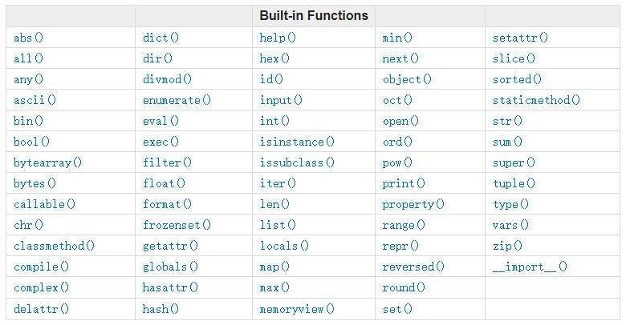

# 内建函数

## 1、内建函数 <a id="1&#x5185;&#x5EFA;&#x51FD;&#x6570;"></a>

在python交互模式下，键入相应的命令即可查看当前python版本的一些内建函数：

```python
>>> # dir(__builtins__)
>>> import builtins
>>> dir(builtins)  
['ArithmeticError', 'AssertionError', 'AttributeError', 'BaseException',
 'BlockingIOError', 'BrokenPipeError', 'BufferError', 'BytesWarning',
 'ChildProcessError', 'ConnectionAbortedError', 'ConnectionError',
 'ConnectionRefusedError', 'ConnectionResetError', 'DeprecationWarning',
 'EOFError', 'Ellipsis', 'EnvironmentError', 'Exception', 'False',
 'FileExistsError', 'FileNotFoundError', 'FloatingPointError',
 'FutureWarning', 'GeneratorExit', 'IOError', 'ImportError',
 'ImportWarning', 'IndentationError', 'IndexError', 'InterruptedError',
 'IsADirectoryError', 'KeyError', 'KeyboardInterrupt', 'LookupError',
 'MemoryError', 'NameError', 'None', 'NotADirectoryError', 'NotImplemented',
 'NotImplementedError', 'OSError', 'OverflowError',
 'PendingDeprecationWarning', 'PermissionError', 'ProcessLookupError',
 'ReferenceError', 'ResourceWarning', 'RuntimeError', 'RuntimeWarning',
 'StopIteration', 'SyntaxError', 'SyntaxWarning', 'SystemError',
 'SystemExit', 'TabError', 'TimeoutError', 'True', 'TypeError',
 'UnboundLocalError', 'UnicodeDecodeError', 'UnicodeEncodeError',
 'UnicodeError', 'UnicodeTranslateError', 'UnicodeWarning', 'UserWarning',
 'ValueError', 'Warning', 'ZeroDivisionError', '_', '__build_class__',
 '__debug__', '__doc__', '__import__', '__name__', '__package__', 'abs',
 'all', 'any', 'ascii', 'bin', 'bool', 'bytearray', 'bytes', 'callable',
 'chr', 'classmethod', 'compile', 'complex', 'copyright', 'credits',
 'delattr', 'dict', 'dir', 'divmod', 'enumerate', 'eval', 'exec', 'exit',
 'filter', 'float', 'format', 'frozenset', 'getattr', 'globals', 'hasattr',
 'hash', 'help', 'hex', 'id', 'input', 'int', 'isinstance', 'issubclass',
 'iter', 'len', 'license', 'list', 'locals', 'map', 'max', 'memoryview',
 'min', 'next', 'object', 'oct', 'open', 'ord', 'pow', 'print', 'property',
 'quit', 'range', 'repr', 'reversed', 'round', 'set', 'setattr', 'slice',
 'sorted', 'staticmethod', 'str', 'sum', 'super', 'tuple', 'type', 'vars',
 'zip']
```



## 2、通用内建函数 <a id="2&#x901A;&#x7528;&#x5185;&#x5EFA;&#x51FD;&#x6570;"></a>

## 3、数值计算 <a id="3&#x6570;&#x503C;&#x8BA1;&#x7B97;"></a>

<table>
  <thead>
    <tr>
      <th style="text-align:center">&#x51FD;&#x6570;</th>
      <th style="text-align:left">&#x542B;&#x4E49;</th>
    </tr>
  </thead>
  <tbody>
    <tr>
      <td style="text-align:center">abs(x)</td>
      <td style="text-align:left">&#x8FD4;&#x56DE;&#x6570;&#x5B57;&#x7684;&#x7EDD;&#x5BF9;&#x503C;&#xFF0C;&#x5982;abs(-10)
        &#x8FD4;&#x56DE; 10&#x3002;</td>
    </tr>
    <tr>
      <td style="text-align:center">cmp(x, y)</td>
      <td style="text-align:left">
        <p>&#x5982;&#x679C; x &lt; y &#x8FD4;&#x56DE; -1, &#x5982;&#x679C; x == y
          &#x8FD4;&#x56DE; 0, &#x5982;&#x679C; x &gt; y &#x8FD4;&#x56DE; 1&#x3002;</p>
        <p>Python 3 &#x5DF2;&#x5E9F;&#x5F03;&#xFF0C;&#x4F7F;&#x7528; (x &gt; y) -
          (x &lt; y) &#x66FF;&#x6362;&#x3002;</p>
      </td>
    </tr>
    <tr>
      <td style="text-align:center">divmod(a, b)</td>
      <td style="text-align:left">&#x5206;&#x522B;&#x53D6;&#x5546;&#x548C;&#x4F59;&#x6570;&#x3002;&#x6574;&#x578B;&#x3001;&#x6D6E;&#x70B9;&#x578B;&#x90FD;&#x53EF;&#x4EE5;&#x3002;</td>
    </tr>
    <tr>
      <td style="text-align:center">pow(x, y[, z])</td>
      <td style="text-align:left">&#x8FD4;&#x56DE;x&#x7684;y&#x6B21;&#x5E42;&#x3002;</td>
    </tr>
    <tr>
      <td style="text-align:center">round(x[, n])</td>
      <td style="text-align:left">&#x56DB;&#x820D;&#x4E94;&#x5165;&#x3002;</td>
    </tr>
  </tbody>
</table>

## 4、集合操作 <a id="4&#x96C6;&#x5408;&#x64CD;&#x4F5C;"></a>

## 5、进制转换 <a id="5&#x8FDB;&#x5236;&#x8F6C;&#x6362;"></a>

## 6、类型工厂函数 <a id="6&#x7C7B;&#x578B;&#x5DE5;&#x5382;&#x51FD;&#x6570;"></a>

Python 2.2 统一了类型和类，所有的内建类型现在也都是类，在这基础之上，原来的所谓内建类型转换函数像`int(), type(), list()`等等，现在都成了工厂函数。也就是说虽然他们看上去是函数，实质上他们是类。当调用它们时，实际上是生成了该类型的一个实例。

